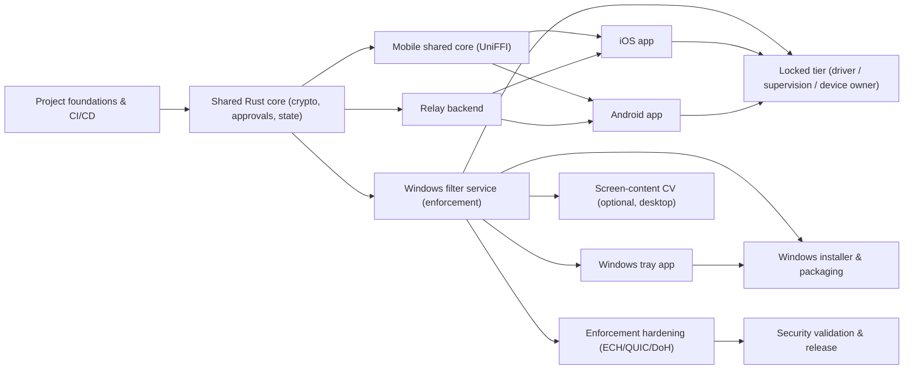

# Content Filter — Delivery Backlog

> Generated companion to `create_backlog.sh`. This is the human-readable plan: every epic, every task, its blockers, and its validation criteria (Definition of Done). The script creates all of this in GitHub as issues in a Project, with dependencies encoded as **Blocked by** references.

**90 issues** — 13 epics, 77 tasks across 4 milestones (M0: 7, M1: 67, M2: 9, M3: 7).

## Milestones (phases)

- **Phase 0 — Foundations** — 7 issues
- **Phase 1 — Accountability Core** — 67 issues
- **Phase 2 — Locked Tier & Screen-CV** — 9 issues
- **Phase 3 — Hardening & Release** — 7 issues

## How dependencies work here

Each issue body carries a **Blocked by: #…** line and an **Epic: #…** parent link. An issue is ready when all its blockers are closed. Where your `gh`/GitHub supports it, the script also links epics to their children as native **sub-issues**. "Which blocks who" is fully encoded: if A is *blocked by* B, then B *blocks* A.

## Build order (dependency waves)

Topologically-computed waves — everything in a wave can proceed in parallel once earlier waves are done. Recommended execution order.

- **Wave 0** — e-foundations, f-repo-scaffold, ios-entitlement
- **Wave 1** — core-models, e-core, f-ci, f-secrets-keymgmt, f-threat-model-doc
- **Wave 2** — core-crypto-approvals, core-crypto-sealing, e-mobile, e-relay, e-service, f-repro-builds, f-test-harness, rel-docs, relay-bootstrap, svc-skeleton
- **Wave 3** — core-hashchain, core-timeanchor, e-android, e-enforcement, e-ios, e-screencv, e-tray, relay-auth, svc-browser-doh, svc-hosts-tripwire, svc-ipc, svc-watchdog-guardian
- **Wave 4** — core-relay-client, core-weakening, e-installer, e-locked, e-security, relay-registry-pairing, tray-skeleton
- **Wave 5** — core-uniffi-scaffold, inst-wix-package, relay-feeds, relay-heartbeat-silence, relay-log, relay-timeanchor, svc-config-anchor, tray-monitored-badge
- **Wave 6** — hard-doh-feed-ops, inst-custom-actions, inst-signing, mob-uniffi-android, mob-uniffi-ios, relay-approvals-transport, relay-email-fallback, svc-approvals, svc-heartbeat, svc-integrity, svc-resolver
- **Wave 7** — and-app-shell, inst-consent-ui, ios-app-shell, relay-push, svc-bootgap, svc-categories, svc-egress-wfp, svc-notifier, svc-nrpt, tray-request-flows
- **Wave 8** — and-partner-mode, and-vpnservice, cv-capture, ios-familycontrols, ios-partner-mode, lock-wfp-driver, relay-deploy, svc-canary, svc-fail-closed, svc-quic-block, tray-approval-entry
- **Wave 9** — and-watchdog, cv-inference, ios-deviceactivity, lock-android-deviceowner, lock-ios-supervision, rel-beta, sec-key-recovery
- **Wave 10** — cv-reporting, hard-bypass-matrix, lock-uninstall-approval
- **Wave 11** — sec-privacy-review, sec-threat-validation
- **Wave 12** — sec-pentest

## Epic dependency graph

## Critical path (Phase-1 spine)

Longest chain gating a shippable Phase-1 beta:

`f-repo-scaffold → core-models → core-crypto-approvals → core-weakening → svc-approvals → tray-request-flows` (Windows enforcement spine), in parallel with `core-* → relay-registry-pairing → relay-approvals-transport → relay-push → {ios,and}-partner-mode → rel-beta` (accountability spine). **Build relay + core early** — they gate every accountability property.

## Tickets by epic

### EPIC: Project foundations & CI/CD

*Workspace, pipelines, reproducible builds and key management that everything else depends on.*  
Milestone: **Phase 0 — Foundations** · Epic depends on: —

#### `f-repo-scaffold` — Scaffold Cargo workspace and module layout
Create the workspace and empty crates per the project structure so all later work has a home.  
**Milestone:** M0 · **Blocked by:** _none — ready_  
**Validation / Definition of Done:**
- [ ] cargo build compiles the whole workspace
- [ ] cargo fmt --check passes
- [ ] cargo clippy -D warnings passes
- [ ] directory tree matches the design doc section 16

#### `f-ci` — Set up CI (build, test, clippy, fmt)
Automated checks on every PR across Windows and Linux runners.  
**Milestone:** M0 · **Blocked by:** `f-repo-scaffold`  
**Validation / Definition of Done:**
- [ ] PR triggers CI
- [ ] clippy warning fails the build
- [ ] main stays green
- [ ] test results visible on PR

#### `f-secrets-keymgmt` — Establish release-key management and pinning
The project release key signs blocklists, feeds and binaries; its fingerprint is pinned in clients.  
**Milestone:** M0 · **Blocked by:** `f-repo-scaffold`  
**Validation / Definition of Done:**
- [ ] Signing uses an offline key
- [ ] fingerprint is reproducible and committed
- [ ] rotation runbook reviewed
- [ ] no private key in repo or CI logs

#### `f-threat-model-doc` — Commit living threat-model and invariants doc
A repo-tracked doc mapping each threat to a control or test, kept in sync with the design.  
**Milestone:** M0 · **Blocked by:** `f-repo-scaffold`  
**Validation / Definition of Done:**
- [ ] every defended threat maps to a ticket or test
- [ ] residuals explicitly listed
- [ ] reviewed and signed off

#### `f-test-harness` — Build enforcement integration-test harness
A sandbox that can assert DNS/egress outcomes so enforcement tickets have a way to prove blocking.  
**Milestone:** M0 · **Blocked by:** `f-ci`  
**Validation / Definition of Done:**
- [ ] harness asserts a domain is sinkholed and an egress port is denied
- [ ] sample test green in CI
- [ ] documented Windows runner path

#### `f-repro-builds` — Reproducible builds and signed release pipeline
The open-source trust story requires that shipped binaries provably match source.  
**Milestone:** M0 · **Blocked by:** `f-ci`  
**Validation / Definition of Done:**
- [ ] two independent builds of a tag produce identical hashes
- [ ] release publishes signed artifacts + checksums
- [ ] documented third-party verification steps

### EPIC: Shared Rust core (crypto, approvals, state)

*The single implementation of the security-critical logic shared by Windows, relay, iOS and Android via UniFFI.*  
Milestone: **Phase 1 — Accountability Core** · Epic depends on: `e-foundations`

#### `core-models` — Core data models and serialization
Shared types used everywhere: FilterState, Household, Device, TrustAnchor, NotificationEvent.  
**Milestone:** M1 · **Blocked by:** `f-repo-scaffold`  
**Validation / Definition of Done:**
- [ ] serde round-trips for every type
- [ ] schema matches design section 13.8 and 14
- [ ] version field present and checked

#### `core-crypto-approvals` — Ed25519 approval sign/verify + canonical statement
Approvals are asymmetric signatures over a canonical statement; this is the invariant that makes accountability unforgeable.  
**Milestone:** M1 · **Blocked by:** `core-models`  
**Validation / Definition of Done:**
- [ ] valid signature verifies
- [ ] tampered payload fails
- [ ] wrong key fails
- [ ] known-answer vectors pass
- [ ] NEGATIVE: holder of only the verify key cannot forge (test)
- [ ] fuzz the canonical encoder

#### `core-crypto-sealing` — X25519 sealed-box for unblock request payloads
Unblock request domain/reason are sealed to the partner so the relay never sees a URL.  
**Milestone:** M1 · **Blocked by:** `core-models`  
**Validation / Definition of Done:**
- [ ] seal/open round-trips
- [ ] a party without the private key cannot decrypt (test)
- [ ] tamper -> auth failure
- [ ] request hash does not reveal domain

#### `core-hashchain` — Hash-chained, signed event log
Per-household hash chain with per-device signatures so relay censorship leaves a detectable hole.  
**Milestone:** M1 · **Blocked by:** `core-crypto-approvals`  
**Validation / Definition of Done:**
- [ ] chain verifies end to end
- [ ] removing/reordering/inserting an event breaks verification (tests)
- [ ] gap detection returns the missing seqs
- [ ] per-device signature enforced

#### `core-timeanchor` — Signed time anchors and effective-now logic
Defeats clock rollback: validity is clamped to a monotonic, relay-signed time floor.  
**Milestone:** M1 · **Blocked by:** `core-crypto-approvals`  
**Validation / Definition of Done:**
- [ ] rollback below floor cannot revive an expired approval (test)
- [ ] forward jump cannot pre-activate (not_before)
- [ ] unsigned/tampered anchor rejected
- [ ] floor persists across restart

#### `core-weakening` — Weakening state machine (cooling-off + approval)
Strengthening is instant; weakening is delayed and/or approved. The mechanism that defends the weak moment.  
**Milestone:** M1 · **Blocked by:** `core-timeanchor` `core-crypto-approvals`  
**Validation / Definition of Done:**
- [ ] table-driven tests for every policy-matrix row
- [ ] cooling-off uses the signed anchor not the local clock
- [ ] partner approval shortcuts the wait
- [ ] veto and cancel work
- [ ] temporary unblock auto-reverts
- [ ] strengthening is instant

#### `core-relay-client` — Relay client library
Register, pull signed feeds, push signed events, receive approvals, with offline resilience.  
**Milestone:** M1 · **Blocked by:** `core-models` `core-hashchain`  
**Validation / Definition of Done:**
- [ ] against a mock relay: register, push event, pull feed with signature verified, receive approval
- [ ] rejects unsigned/invalid feed
- [ ] queues while offline and drains on reconnect

#### `core-uniffi-scaffold` — UniFFI export scaffolding
Expose the core to Swift and Kotlin so mobile shares one crypto implementation.  
**Milestone:** M1 · **Blocked by:** `core-weakening` `core-relay-client`  
**Validation / Definition of Done:**
- [ ] generated Swift and Kotlin bindings compile in CI
- [ ] a round-trip approve/verify call works from both host stubs
- [ ] ABI documented

### EPIC: Relay backend

*Thin cloud relay: registry, signed feeds, hash-chained log, push, time anchors, approval transport. Mints/decrypts nothing.*  
Milestone: **Phase 1 — Accountability Core** · Epic depends on: `e-core`

#### `relay-bootstrap` — Relay service skeleton (axum + TLS + config)
The HTTP/WebSocket backbone with TLS and structured logging.  
**Milestone:** M1 · **Blocked by:** `core-models`  
**Validation / Definition of Done:**
- [ ] service starts and health returns 200
- [ ] TLS enforced (no plaintext)
- [ ] logs structured
- [ ] shuts down gracefully

#### `relay-auth` — Per-device key auth + replay guard
Every mutating request is signed by a registered device; nonce+timestamp stop replay.  
**Milestone:** M1 · **Blocked by:** `relay-bootstrap` `core-crypto-approvals`  
**Validation / Definition of Done:**
- [ ] valid device-signed request accepted
- [ ] replayed nonce rejected
- [ ] stale timestamp rejected
- [ ] unknown device rejected

#### `relay-registry-pairing` — Household registry, trust anchor, pairing codes
Stores the signed trust anchor (partner keys, cooling-off floor) authoritatively and issues pairing codes.  
**Milestone:** M1 · **Blocked by:** `relay-auth`  
**Validation / Definition of Done:**
- [ ] create household stores a signed anchor
- [ ] join with a code registers the device pubkey
- [ ] anchor served signed
- [ ] expired/invalid codes rejected
- [ ] anchor is server-authoritative (test)

#### `relay-log` — Append-only hash-chained event log
Server side of the transparency log with gap/fork detection and retention that preserves the head.  
**Milestone:** M1 · **Blocked by:** `relay-registry-pairing` `core-hashchain`  
**Validation / Definition of Done:**
- [ ] appends verify against the chain
- [ ] out-of-order/missing seq flagged
- [ ] fork detected
- [ ] households isolated
- [ ] prune keeps continuity head

#### `relay-feeds` — Signed blocklist + DoH-endpoint feed distribution
Versioned, release-key-signed feeds so a MITM cannot push an empty list.  
**Milestone:** M1 · **Blocked by:** `relay-registry-pairing`  
**Validation / Definition of Done:**
- [ ] feeds served with a valid release-key signature
- [ ] version increments
- [ ] client rejects a bad signature
- [ ] conditional GET works

#### `relay-timeanchor` — Emit signed time-anchor beacons
Periodic signed (utc,seq) beacons that clients persist as a monotonic time floor.  
**Milestone:** M1 · **Blocked by:** `relay-registry-pairing` `core-timeanchor`  
**Validation / Definition of Done:**
- [ ] beacon is signed and monotonic
- [ ] devices persist the floor
- [ ] a tampered beacon is rejected

#### `relay-heartbeat-silence` — Heartbeat tracking + DeviceSilent detection
Silence is the primary backstop against a hostile admin who kills or suspends the agent.  
**Milestone:** M1 · **Blocked by:** `relay-registry-pairing`  
**Validation / Definition of Done:**
- [ ] missed heartbeats beyond threshold emit DeviceSilent
- [ ] resumed heartbeat clears it
- [ ] simulated kill/suspend/airplane triggers the alert
- [ ] per-device tracking

#### `relay-approvals-transport` — Route sealed/signed approvals and requests
The relay carries ciphertext and signatures only; it can neither mint approvals nor read requests.  
**Milestone:** M1 · **Blocked by:** `relay-log`  
**Validation / Definition of Done:**
- [ ] ciphertext routed unchanged
- [ ] relay cannot decrypt (no private key) test
- [ ] approval delivered to the target device
- [ ] a dropped message surfaces downstream as a log gap

#### `relay-push` — APNs + FCM push fan-out
Background push to phones (impossible without APNs/FCM).  
**Milestone:** M1 · **Blocked by:** `relay-approvals-transport`  
**Validation / Definition of Done:**
- [ ] push delivered to sandbox APNs and FCM targets
- [ ] token rotation handled
- [ ] failures retried and logged

#### `relay-email-fallback` — Independent SMTP alert channel
A channel independent of relay push so relay censorship cannot suppress critical alerts.  
**Milestone:** M1 · **Blocked by:** `relay-log`  
**Validation / Definition of Done:**
- [ ] tamper/silence/log-gap events email out even with push disabled
- [ ] path is independent of the relay push service
- [ ] delivery retried

#### `relay-deploy` — Relay deployment + data minimization
Reproducible deploy storing only the minimum, with backups and retention.  
**Milestone:** M1 · **Blocked by:** `relay-push` `relay-email-fallback`  
**Validation / Definition of Done:**
- [ ] reproducible deploy
- [ ] audit confirms only minimal fields stored
- [ ] retention job runs
- [ ] restore from backup verified

### EPIC: Windows filter service (enforcement)

*LocalSystem service: embedded resolver, NRPT, WFP egress lock, ECH/QUIC handling, watchdog, canary, IPC, approvals.*  
Milestone: **Phase 1 — Accountability Core** · Epic depends on: `e-core`

#### `svc-skeleton` — Windows service skeleton (SCM, ACLs, logging)
LocalSystem service host with correct filesystem ACLs and rotating logs.  
**Milestone:** M1 · **Blocked by:** `core-models`  
**Validation / Definition of Done:**
- [ ] installs/starts/stops via SCM
- [ ] runs as LocalSystem
- [ ] ACLs match design section 8.5
- [ ] logs rotate at size limit

#### `svc-config-anchor` — Config load + server-anchor validation
Security-critical params come from the signed anchor, not local config; tampering is detected.  
**Milestone:** M1 · **Blocked by:** `svc-skeleton` `relay-registry-pairing`  
**Validation / Definition of Done:**
- [ ] refuses a partner key or cooling-off weaker than the anchor
- [ ] emits AnchorMismatch on swap attempt
- [ ] emits ConfigChanged for unmanaged edits
- [ ] anchor pinned at install

#### `svc-ipc` — Named-pipe IPC server (HMAC, requests-only)
Authenticated local IPC that can request actions but can never itself approve a weakening.  
**Milestone:** M1 · **Blocked by:** `svc-skeleton`  
**Validation / Definition of Done:**
- [ ] valid HMAC request dispatched
- [ ] replay/stale rejected
- [ ] pipe ACL correct
- [ ] IPC alone cannot apply a weakening without a partner signature (test)

#### `svc-resolver` — Embedded filtering DNS resolver + ECH strip
On-device resolver is the chokepoint; strips ECH configs so SNI stays inspectable.  
**Milestone:** M1 · **Blocked by:** `svc-skeleton` `relay-feeds`  
**Validation / Definition of Done:**
- [ ] blocked name returns NXDOMAIN/sinkhole
- [ ] allowed names resolve
- [ ] ech= stripped from responses (capture test)
- [ ] queries stay on device (no third-party egress)

#### `svc-nrpt` — Force system resolver via NRPT + re-assert
NRPT is the OS-sanctioned way to force the local resolver; the monitor re-asserts it.  
**Milestone:** M1 · **Blocked by:** `svc-resolver`  
**Validation / Definition of Done:**
- [ ] NRPT points to the local resolver
- [ ] a manual DNS change is reverted within one monitor tick and emits TamperDetected
- [ ] survives reboot

#### `svc-categories` — Category manifests + messaging-wins-ties
Adult always on, social optional, YouTube sub-toggle, messaging never blocked.  
**Milestone:** M1 · **Blocked by:** `svc-resolver`  
**Validation / Definition of Done:**
- [ ] adult always active
- [ ] social toggles
- [ ] youtube independent
- [ ] messaging allowlist beats social on fused domains (messenger.com allowed while facebook.com blocked)
- [ ] disabling social routes through the weakening state machine

#### `svc-egress-wfp` — User-mode WFP egress lock
Deny the routes around the chokepoint without a kernel driver.  
**Milestone:** M1 · **Blocked by:** `svc-resolver` `relay-feeds`  
**Validation / Definition of Done:**
- [ ] outbound :53/:853 to non-approved resolvers blocked
- [ ] DoH endpoint IPs blocked
- [ ] VPN/Tor endpoints blocked or alerted
- [ ] no kernel driver required

#### `svc-quic-block` — Block UDP/443 (QUIC) to force TCP fallback
Removing QUIC restores an inspectable TCP ClientHello.  
**Milestone:** M1 · **Blocked by:** `svc-egress-wfp`  
**Validation / Definition of Done:**
- [ ] UDP/443 outbound denied except allowlist
- [ ] browsers fall back to TCP
- [ ] SNI becomes visible in capture
- [ ] disabling the block is a cooling-off + notify action

#### `svc-browser-doh` — Browser DoH policy lockdown + monitor
Policy-lock encrypted DNS in Chrome/Edge/Firefox and re-assert if changed.  
**Milestone:** M1 · **Blocked by:** `svc-skeleton`  
**Validation / Definition of Done:**
- [ ] policies set and greyed out in-browser
- [ ] reverted and TamperDetected if changed
- [ ] covers all installed supported browsers

#### `svc-hosts-tripwire` — Hosts tripwire (capped) + tamper detection
A small top-domain tripwire, not the full blocklist, to catch the naive editor.  
**Milestone:** M1 · **Blocked by:** `svc-skeleton`  
**Validation / Definition of Done:**
- [ ] tripwire present and capped
- [ ] edit/delete detected, re-applied, TamperDetected emitted
- [ ] no DNS-client perf regression from size

#### `svc-heartbeat` — Signed heartbeat emitter + liveness ticks
First-class PC heartbeats so the relay can detect a killed/suspended agent.  
**Milestone:** M1 · **Blocked by:** `svc-config-anchor` `relay-heartbeat-silence`  
**Validation / Definition of Done:**
- [ ] heartbeats signed with the device key at the configured interval
- [ ] relay marks the device active
- [ ] force-kill leads to DeviceSilent within the window

#### `svc-bootgap` — Boot-gap / ControlsAbsent detection
Detect tampering done while the service was not running (Safe Mode, USB boot, offline edits).  
**Milestone:** M1 · **Blocked by:** `svc-heartbeat`  
**Validation / Definition of Done:**
- [ ] simulated downtime emits ControlsAbsent{from,to} on next start
- [ ] cross-checks relay last-heartbeat
- [ ] absent WFP filters flagged

#### `svc-canary` — Multi-path production canary
Continuously prove the block holds across every path that matters.  
**Milestone:** M1 · **Blocked by:** `svc-egress-wfp` `svc-resolver`  
**Validation / Definition of Done:**
- [ ] all paths blocked -> green heartbeat
- [ ] a deliberately opened path -> FilterHoleDetected{path}
- [ ] the DoH provider set rotates
- [ ] runs on interval

#### `svc-integrity` — Last-known-good config/control diffing
The service knows what it applied and flags anything it did not.  
**Milestone:** M1 · **Blocked by:** `svc-config-anchor`  
**Validation / Definition of Done:**
- [ ] any unmanaged change to a managed control emits an event with a diff
- [ ] self-performed changes are suppressed
- [ ] store is integrity-protected

#### `svc-approvals` — Verify approvals + drive weakening state machine
Wire Ed25519 verification and the cooling-off machine into the service.  
**Milestone:** M1 · **Blocked by:** `svc-ipc` `core-weakening` `svc-config-anchor`  
**Validation / Definition of Done:**
- [ ] a valid partner approval applies the action
- [ ] forged/rollback/expired approvals rejected
- [ ] cooling-off enforced by the anchor clock
- [ ] veto/cancel/auto-revert all work

#### `svc-watchdog-guardian` — Paired watchdog (service + guardian)
Mutual restart for crashes and casual kills; silence covers the hostile case.  
**Milestone:** M1 · **Blocked by:** `svc-skeleton`  
**Validation / Definition of Done:**
- [ ] killing the service -> guardian restarts it and alerts
- [ ] killing the guardian -> service restarts it and alerts
- [ ] simultaneous suspend is documented as covered by relay silence (test)

#### `svc-notifier` — PartnerNotifier (relay + SMTP)
One trait, two channels; critical events go out both; unblock payloads are sealed.  
**Milestone:** M1 · **Blocked by:** `core-relay-client` `relay-approvals-transport` `relay-email-fallback`  
**Validation / Definition of Done:**
- [ ] events reach the relay
- [ ] critical events are dual-channel
- [ ] retry/backoff
- [ ] sealed unblock payloads are never sent to the relay in cleartext (test)

#### `svc-fail-closed` — Fail-closed policy
When the engine is down, default to deny, while keeping recovery paths reachable.  
**Milestone:** M1 · **Blocked by:** `svc-resolver` `svc-egress-wfp`  
**Validation / Definition of Done:**
- [ ] resolver down -> HTTP(S) to unresolved hosts denied while relay/filter still reachable
- [ ] an offline temporary unblock past its window reverts to blocked
- [ ] FailClosedEngaged emitted

### EPIC: Windows tray app

*User-session UI: status, request flows into the weakening state machine, approval entry, persistent monitored badge.*  
Milestone: **Phase 1 — Accountability Core** · Epic depends on: `e-service`

#### `tray-skeleton` — Tray app skeleton + IPC client
The user-session UI that talks to the service over the signed pipe.  
**Milestone:** M1 · **Blocked by:** `svc-ipc`  
**Validation / Definition of Done:**
- [ ] connects to the pipe
- [ ] signs requests
- [ ] reflects service status live

#### `tray-request-flows` — Unblock/uninstall/pause request flows
Requests enter the weakening state machine and show the cooling-off timer.  
**Milestone:** M1 · **Blocked by:** `tray-skeleton` `svc-approvals`  
**Validation / Definition of Done:**
- [ ] a request creates WeakeningRequested
- [ ] the cooling-off timer is anchor-clocked (not local)
- [ ] approved/vetoed/effective states reflected
- [ ] payload sealed to the partner

#### `tray-approval-entry` — Approval entry + notification history
Enter/scan a partner approval and review the accountability log locally.  
**Milestone:** M1 · **Blocked by:** `tray-request-flows`  
**Validation / Definition of Done:**
- [ ] a valid approval applies the action
- [ ] an invalid one is rejected with a reason
- [ ] history lists recent events

#### `tray-monitored-badge` — Persistent monitored indicator
A non-dismissible badge enforcing the self-imposed-accountability framing.  
**Milestone:** M1 · **Blocked by:** `tray-skeleton`  
**Validation / Definition of Done:**
- [ ] badge is visible whenever enrolled
- [ ] it cannot be permanently dismissed
- [ ] it reflects filter state

### EPIC: Windows installer & packaging

*WiX MSI, custom actions (key gen, anchor pinning, DPAPI), consent/enrollment UI, Authenticode signing.*  
Milestone: **Phase 1 — Accountability Core** · Epic depends on: `e-service`, `e-tray`

#### `inst-wix-package` — WiX v4 package (service, tray, ACLs)
The MSI that installs the service, tray and guardian with correct ACLs.  
**Milestone:** M1 · **Blocked by:** `svc-skeleton` `tray-skeleton`  
**Validation / Definition of Done:**
- [ ] MSI installs service+tray+guardian to Program Files
- [ ] ACLs applied
- [ ] uninstall removes cleanly
- [ ] major-upgrade works

#### `inst-custom-actions` — Installer custom actions (keys, anchor, DPAPI)
Rust CA DLL that provisions keys and pins the trust anchor at install.  
**Milestone:** M1 · **Blocked by:** `inst-wix-package` `svc-config-anchor`  
**Validation / Definition of Done:**
- [ ] install provisions keys (TPM-backed where present), pins the anchor, encrypts SMTP
- [ ] uninstall removes managed enforcement
- [ ] actions are idempotent

#### `inst-consent-ui` — Installer consent + enrollment UI
Interactive local consent and pairing so the tool cannot be silently installed on someone else.  
**Milestone:** M1 · **Blocked by:** `inst-custom-actions` `relay-registry-pairing`  
**Validation / Definition of Done:**
- [ ] enrollment requires interactive local consent and local admin
- [ ] pairs to a household
- [ ] tier selectable
- [ ] a silent/unattended enroll is refused (test)

#### `inst-signing` — Authenticode signing of binaries + MSI
Signed, timestamped release artifacts consistent with the reproducible-build story.  
**Milestone:** M1 · **Blocked by:** `inst-wix-package` `f-repro-builds`  
**Validation / Definition of Done:**
- [ ] MSI and exes are signed and timestamped
- [ ] signatures verify
- [ ] unsigned dev builds are clearly flagged

### EPIC: Mobile shared core (UniFFI)

*Swift and Kotlin bindings over the Rust core so mobile never re-implements crypto.*  
Milestone: **Phase 1 — Accountability Core** · Epic depends on: `e-core`

#### `mob-uniffi-ios` — Swift bindings package (SPM) from core
A Swift package wrapping the Rust core so iOS never re-implements crypto.  
**Milestone:** M1 · **Blocked by:** `core-uniffi-scaffold`  
**Validation / Definition of Done:**
- [ ] Swift package builds
- [ ] approve/verify and relay client are callable
- [ ] CI builds it on macOS

#### `mob-uniffi-android` — Kotlin bindings (AAR) from core
An AAR wrapping the Rust core for Android.  
**Milestone:** M1 · **Blocked by:** `core-uniffi-scaffold`  
**Validation / Definition of Done:**
- [ ] AAR builds
- [ ] native lib loads via JNI
- [ ] approve/verify callable
- [ ] CI builds it

### EPIC: iOS app

*SwiftUI companion + filter: FamilyControls (Hardened), Secure-Enclave approvals, relay + push.*  
Milestone: **Phase 1 — Accountability Core** · Epic depends on: `e-mobile`, `e-relay`

#### `ios-entitlement` — Obtain Apple FamilyControls entitlement
A schedule dependency, not code: Family Controls (Managed Settings) needs Apple approval. Start early.  
**Milestone:** M1 · **Blocked by:** _none — ready_  
**Validation / Definition of Done:**
- [ ] entitlement granted by Apple
- [ ] provisioning profiles updated
- [ ] dependency tracked on the release plan

#### `ios-app-shell` — iOS app shell + relay client + Keychain key
SwiftUI shell that registers the device with a Secure-Enclave identity key.  
**Milestone:** M1 · **Blocked by:** `mob-uniffi-ios` `relay-registry-pairing`  
**Validation / Definition of Done:**
- [ ] registers the device with a hardware-backed key
- [ ] pulls and verifies the blocklist
- [ ] dashboard shows filter state
- [ ] a TestFlight build runs

#### `ios-familycontrols` — FamilyControls filter engine (Hardened)
Screen Time / Managed Settings shields for the configured categories.  
**Milestone:** M1 · **Blocked by:** `ios-app-shell`  
**Validation / Definition of Done:**
- [ ] with the entitlement, configured categories are blocked in Safari and apps
- [ ] DNS profile applied
- [ ] requires Screen Time authorization
- [ ] limits documented (revocable without supervision)

#### `ios-deviceactivity` — DeviceActivityMonitor extension (re-assert + heartbeat)
Re-assert shields and report state; disabling Screen Time surfaces as an alert.  
**Milestone:** M1 · **Blocked by:** `ios-familycontrols` `relay-heartbeat-silence`  
**Validation / Definition of Done:**
- [ ] shields re-assert after a change
- [ ] heartbeat reaches the relay
- [ ] disabling Screen Time emits FilterDisabled and eventually DeviceSilent

#### `ios-partner-mode` — iOS partner mode (Secure-Enclave approvals)
One-tap approve/veto signed by a non-exportable Enclave key; can decrypt sealed unblocks.  
**Milestone:** M1 · **Blocked by:** `ios-app-shell` `relay-approvals-transport` `relay-push`  
**Validation / Definition of Done:**
- [ ] one-tap approve signs with the Enclave key
- [ ] can open a sealed unblock (box key)
- [ ] push received
- [ ] forgery is impossible without the private key (design test)

### EPIC: Android app

*Compose companion + filter: foreground VpnService DNS/SNI + ECH/QUIC, StrongBox approvals, relay + FCM.*  
Milestone: **Phase 1 — Accountability Core** · Epic depends on: `e-mobile`, `e-relay`

#### `and-app-shell` — Android app shell + relay client + Keystore key
Compose shell that registers the device with a StrongBox/TEE identity key.  
**Milestone:** M1 · **Blocked by:** `mob-uniffi-android` `relay-registry-pairing`  
**Validation / Definition of Done:**
- [ ] registers with a hardware-backed key
- [ ] pulls and verifies the blocklist
- [ ] dashboard shows state
- [ ] an internal build runs

#### `and-vpnservice` — Foreground VpnService DNS/SNI filter + ECH/QUIC
On-device filtering with ECH strip and UDP/443 drop, always-on capable.  
**Milestone:** M1 · **Blocked by:** `and-app-shell`  
**Validation / Definition of Done:**
- [ ] configured categories blocked via on-device DNS
- [ ] ECH stripped
- [ ] UDP/443 dropped
- [ ] always-on option works
- [ ] battery within budget

#### `and-watchdog` — Android watchdog (heartbeat + off-detection)
WorkManager heartbeat and detection of filter-off/app-kill.  
**Milestone:** M1 · **Blocked by:** `and-vpnservice` `relay-heartbeat-silence`  
**Validation / Definition of Done:**
- [ ] heartbeat reaches the relay
- [ ] turning the VPN off emits FilterDisabled
- [ ] killing the app leads to DeviceSilent
- [ ] re-arms after reboot

#### `and-partner-mode` — Android partner mode (Keystore approvals)
One-tap approve/veto signed by a hardware Keystore key; decrypts sealed unblocks.  
**Milestone:** M1 · **Blocked by:** `and-app-shell` `relay-approvals-transport` `relay-push`  
**Validation / Definition of Done:**
- [ ] approve signs with the hardware key
- [ ] can open a sealed unblock
- [ ] FCM received
- [ ] forgery impossible without the private key

### EPIC: Enforcement hardening (ECH/QUIC/DoH)

*Cross-cutting: prove every bypass route is closed and keep the DoH-endpoint feed fresh.*  
Milestone: **Phase 1 — Accountability Core** · Epic depends on: `e-service`

#### `hard-doh-feed-ops` — DoH-endpoint feed maintenance pipeline
Keep the DoH denylist fresh and signed; it rots weekly.  
**Milestone:** M1 · **Blocked by:** `relay-feeds`  
**Validation / Definition of Done:**
- [ ] feed auto-updates on schedule and is signed
- [ ] the canary picks up new providers
- [ ] a stale feed raises an alarm

#### `hard-bypass-matrix` — Automated bypass test matrix
Every documented escape route gets an automated test asserting block + alert.  
**Milestone:** M1 · **Blocked by:** `svc-canary` `svc-quic-block` `svc-browser-doh` `and-vpnservice` `ios-deviceactivity`  
**Validation / Definition of Done:**
- [ ] each route has a test asserting it is blocked and alerted
- [ ] the matrix is a CI gate
- [ ] a coverage report is published

### EPIC: Screen-content CV (optional, desktop)

*On-device, opt-in, alert-only detection layer. Never ships raw frames off device.*  
Milestone: **Phase 2 — Locked Tier & Screen-CV** · Epic depends on: `e-service`

#### `cv-capture` — ROI screen capture + visible indicator
Capture the focused window in the interactive session, with a persistent indicator.  
**Milestone:** M2 · **Blocked by:** `svc-notifier`  
**Validation / Definition of Done:**
- [ ] captures the focused-window ROI (not the whole desktop)
- [ ] a visible indicator is always shown while active
- [ ] runs in the interactive session (not Session 0)

#### `cv-inference` — On-device two-stage ONNX inference
Fast+heavy staged NSFW inference entirely on device.  
**Milestone:** M2 · **Blocked by:** `cv-capture`  
**Validation / Definition of Done:**
- [ ] raw frames never leave the device (network egress test = zero)
- [ ] staged pipeline runs
- [ ] confidence scores emitted
- [ ] accuracy benchmarked on an eval set

#### `cv-reporting` — Threshold -> ScreenContentFlagged (alert-only default)
Turn scores into a partner signal that is alert-only by default and never raw.  
**Milestone:** M2 · **Blocked by:** `cv-inference`  
**Validation / Definition of Done:**
- [ ] alert-only by default
- [ ] no image egress
- [ ] opt-in gating enforced
- [ ] blurred thumbnail optional and never raw by default

### EPIC: Locked tier (driver / supervision / device owner)

*Opt-in hard lockdown: WFP callout driver, iOS supervision, Android Device Owner, approval-gated uninstall.*  
Milestone: **Phase 2 — Locked Tier & Screen-CV** · Epic depends on: `e-service`, `e-ios`, `e-android`

#### `lock-wfp-driver` — WFP callout driver (C/C++ WDK) SNI inspection
Kernel callout for SNI-level DoH/front blocking; the one place we keep C/C++ and EV signing.  
**Milestone:** M2 · **Blocked by:** `svc-egress-wfp`  
**Validation / Definition of Done:**
- [ ] driver inspects ClientHello SNI
- [ ] blocks DoH hostnames and rotating fronts
- [ ] an EV-signed build loads
- [ ] fails closed
- [ ] performance acceptable

#### `lock-ios-supervision` — iOS supervised profile (global filter, locked settings)
Supervision is the only path to a non-disableable iOS filter.  
**Milestone:** M2 · **Blocked by:** `ios-familycontrols`  
**Validation / Definition of Done:**
- [ ] on a supervised device the global filter is non-disableable
- [ ] VPN creation disabled
- [ ] app removal disallowed
- [ ] Screen Time locked
- [ ] flow documented

#### `lock-android-deviceowner` — Android Device Owner provisioning
Device Owner is the real Android lockdown; requires a reset device.  
**Milestone:** M2 · **Blocked by:** `and-vpnservice`  
**Validation / Definition of Done:**
- [ ] on a reset device, provisioning applies always-on VPN lockdown
- [ ] VPN/private-DNS config disallowed
- [ ] uninstall blocked
- [ ] flow documented

#### `lock-uninstall-approval` — Approval-gated uninstall (Locked)
In Locked, uninstall is blocked without a partner approval, by prior consent.  
**Milestone:** M2 · **Blocked by:** `lock-ios-supervision` `lock-android-deviceowner` `svc-approvals`  
**Validation / Definition of Done:**
- [ ] uninstall blocked without a valid partner approval on all Locked platforms
- [ ] with approval, removal is clean and emits events

### EPIC: Security validation & release

*Traceable threat-model validation, partner-key recovery, pen test, privacy audit, beta, docs.*  
Milestone: **Phase 3 — Hardening & Release** · Epic depends on: `e-enforcement`

#### `sec-threat-validation` — Validate every defended threat with a test
A traceability matrix proving each design section 15 defended item has a passing control/test.  
**Milestone:** M3 · **Blocked by:** `hard-bypass-matrix` `svc-approvals` `relay-approvals-transport`  
**Validation / Definition of Done:**
- [ ] every defended threat maps to a passing test
- [ ] residuals explicitly documented
- [ ] security sign-off recorded

#### `sec-key-recovery` — Partner key rotation and recovery flow
The new attack surface: rotating the partner key must be delayed and dual-notified so it cannot be silently swapped.  
**Milestone:** M3 · **Blocked by:** `svc-approvals` `relay-registry-pairing` `ios-partner-mode` `and-partner-mode`  
**Validation / Definition of Done:**
- [ ] rotation requires the old key or a full cooling-off plus multi-channel alert
- [ ] a silent partner-key swap is impossible (test)
- [ ] recovery runbook validated

#### `sec-privacy-review` — Privacy-floor audit
Confirm no browsing history, no URL logging, no DPI, no screenshots off device, minimal relay storage.  
**Milestone:** M3 · **Blocked by:** `relay-deploy` `cv-reporting` `svc-notifier`  
**Validation / Definition of Done:**
- [ ] audit confirms the privacy invariants
- [ ] relay stores only minimal fields
- [ ] sealed unblock verified end to end
- [ ] DPIA published

#### `sec-pentest` — Third-party pen test / red-team
External validation focused on the accountability guarantees and enforcement.  
**Milestone:** M3 · **Blocked by:** `sec-threat-validation`  
**Validation / Definition of Done:**
- [ ] external report delivered
- [ ] critical findings remediated
- [ ] retest passes
- [ ] report archived

#### `rel-docs` — User/partner docs + OSS repo hygiene
Onboarding docs and the open-source hygiene the trust story implies.  
**Milestone:** M3 · **Blocked by:** `f-threat-model-doc`  
**Validation / Definition of Done:**
- [ ] install and pairing guides exist
- [ ] SECURITY.md disclosure policy present
- [ ] reproducible-build verification documented
- [ ] LICENSE chosen

#### `rel-beta` — Phase-1 closed beta
End-to-end validation of the Hardened Windows + relay + partner app spine with real users.  
**Milestone:** M3 · **Blocked by:** `inst-signing` `ios-partner-mode` `and-partner-mode` `relay-deploy`  
**Validation / Definition of Done:**
- [ ] beta cohort onboarded
- [ ] pairing works end to end
- [ ] approvals and alerts verified in the field
- [ ] crash/telemetry within budget

